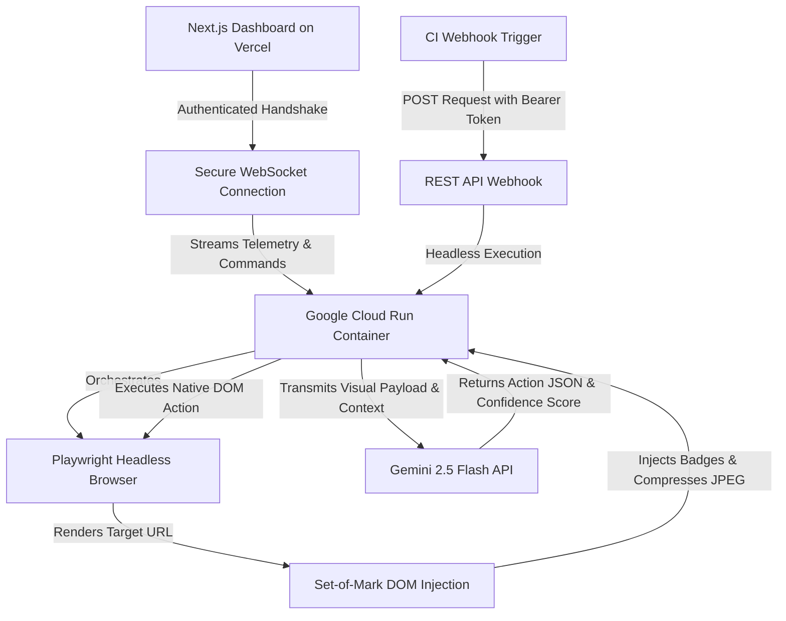

# Prism QA

Prism QA is a deterministic, stateful visual testing agent that autonomously navigates and verifies web applications exactly like a human user. Built for the **Gemini Live Agent Challenge**.

---

## System Architecture

Our engine relies on a stateful execution loop and a **Set-of-Mark visual grounding pipeline** to prevent coordinate hallucinations. The diagram below maps the full cloud infrastructure (Vercel, Cloud Run, Playwright, SoM, Gemini, WebSocket auth, and CI webhook trigger).



---

## Reproducible Testing Instructions

Follow these steps to reproduce our testing environment and run the agent. **Run the backend first, then the frontend.**

### 1. Backend Setup (Playwright Engine)

1. Navigate to the `backend` directory.
2. Run `npm install`.
3. Create a `.env` file from the template and set required variables:
   ```bash
   cp .env.example .env
   ```
   Edit `.env` and set:
   - **`GOOGLE_GENAI_API_KEY`** — Your Google GenAI API key (required for Gemini visual analysis).
   - **`WS_SECRET_TOKEN`** — A secret token for WebSocket and API auth. Pick a strong value; the frontend must use the same token (see Frontend Setup).
   - Optionally: `PORT` (default `3001` for local dev), `ALLOWED_ORIGIN`, `PLAYWRIGHT_HEADLESS`.
4. Run `npm run dev` to start the backend server.
   - **Local dev:** backend listens on **port 3001** (see `PORT` in `.env.example`).
   - **Cloud Run:** the container uses port **8080** at runtime; local dev uses **3001** unless you set `PORT`.

### 2. Frontend Setup (Command Center)

1. Navigate to the `frontend` directory.
2. Run `npm install`.
3. Create a `.env.local` (or copy from `.env.example`) and set:
   - **`NEXT_PUBLIC_WS_URL`** — Backend WebSocket URL. For local dev leave unset to use `ws://localhost:3001/ws`, or set e.g. `ws://localhost:3001/ws`.
   - **`NEXT_PUBLIC_WS_TOKEN`** — Must match the backend `WS_SECRET_TOKEN` for local dev and for production (so the dashboard can connect to the backend).
4. Run `npm run dev` to start the Next.js dashboard on port `3000`.
5. Open `http://localhost:3000` in your browser.

### 3. Optional: Demo target app (dummy-saas)

To use a local app as the target URL for testing:

1. In another terminal, navigate to the `dummy-saas` directory.
2. Run `npm install` then `npm run dev` (default port `3002`).
3. Use **`http://localhost:3002`** as the target URL in the Prism QA dashboard. This is the default target URL in the UI and is suitable for demos.

### 4. Execution

1. Paste your target application URL into the dashboard (e.g. `http://localhost:3002` for the dummy-saas app).
2. Input a natural language objective.
3. Click **Connect**, then **Execute** to watch the agent autonomously navigate the flow.

---

## Automated Google Cloud Deployment

We automated the infrastructure provisioning and container deployment using a custom shell script. Deploying a stateful Playwright browser inside a stateless Google Cloud Run container requires strict memory limits and dependency pinning.

**To deploy the backend to Google Cloud Run:**

1. Authenticate with the Google Cloud CLI.
2. Navigate to the `backend` directory.
3. Set **`GOOGLE_GENAI_API_KEY`** and **`WS_SECRET_TOKEN`** in `backend/.env` (or export them). The deploy script requires both; it will exit with a clear error if either is missing.
4. Execute `bash deploy.sh`.

This script automates the containerization, sets minimum instances to prevent cold starts, and locks session affinity for stable WebSocket connections.

View the automated deployment script here:
[backend/deploy.sh](https://github.com/Ticoworld/prism-qa/blob/master/backend/deploy.sh)
