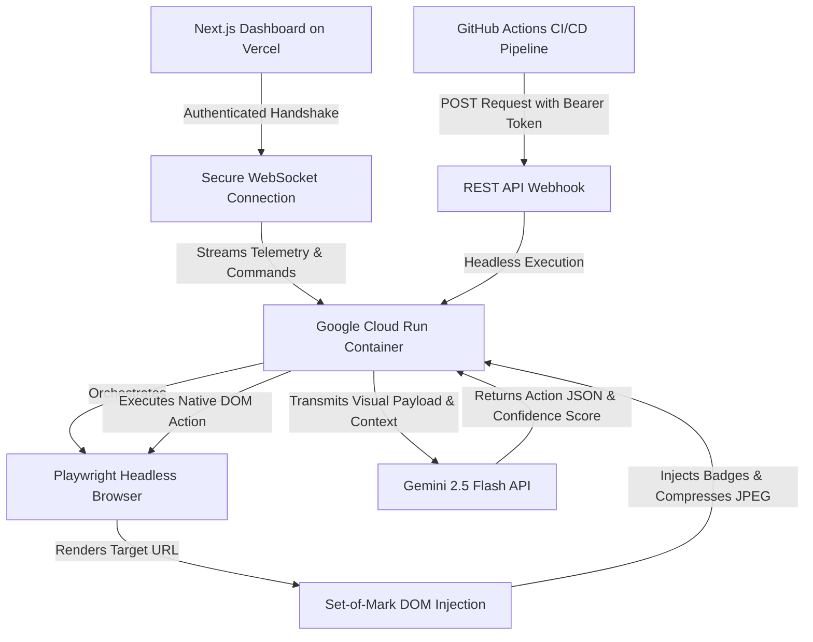

# Prism QA

Prism QA is a deterministic, stateful visual testing agent that autonomously navigates and verifies web applications exactly like a human user. Built for the **Gemini Live Agent Challenge**.

---

## System Architecture

Our engine relies on a stateful execution loop and a **Set-of-Mark visual grounding pipeline** to prevent coordinate hallucinations. The diagram below maps the full cloud infrastructure (Vercel, Cloud Run, Playwright, SoM, Gemini, WebSocket auth, and CI/CD webhook).

---

## Reproducible Testing Instructions

Follow these steps to reproduce our testing environment and run the agent.

### 1. Backend Setup (Playwright Engine)

1. Navigate to the `backend` directory.
2. Run `npm install`.
3. Create a `.env` file and add your `GOOGLE_GENAI_API_KEY`.
4. Run `npm run dev` to start the backend server on port `8080`.

### 2. Frontend Setup (Command Center)

1. Navigate to the root `frontend` directory.
2. Run `npm install`.
3. Run `npm run dev` to start the Next.js dashboard on port `3000`.
4. Open `http://localhost:3000` in your browser.

### 3. Execution

1. Paste your target application URL into the dashboard.
2. Input a natural language objective.
3. Click **Connect and Execute** to watch the agent autonomously navigate the flow.

---

## Automated Google Cloud Deployment

We automated the infrastructure provisioning and container deployment using a custom shell script. Deploying a stateful Playwright browser inside a stateless Google Cloud Run container requires strict memory limits and dependency pinning.

**To deploy the backend to Google Cloud Run:**

1. Authenticate with the Google Cloud CLI.
2. Navigate to the `backend` directory.
3. Execute `bash deploy.sh`.

This script automates the containerization, sets minimum instances to prevent cold starts, and locks session affinity for stable WebSocket connections.

View the automated deployment script here:
[backend/deploy.sh](https://github.com/Ticoworld/prism-qa/blob/master/backend/deploy.sh)
